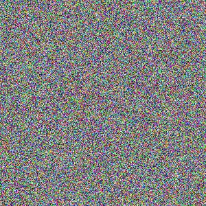
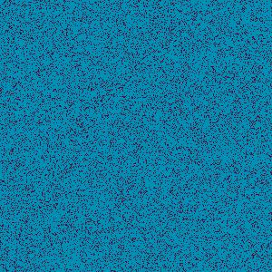

# Random-Pixel-Art
I wanted to do something artsy, and decided on making a random pixel art gen. And I want to eventually do pixel sorting.

In this code I first generate a image of random colors. Then I generate a list of colors that can be specified. With this new list of colors I open the image of random colors and compare each pixel in the color list and find the closest color to the current pixel.

I do this with all pixels in the random color image, and it generates a new image from colors in the color list. Making some cool looking patterns.

## Example

Initial noise

After remake using color list

